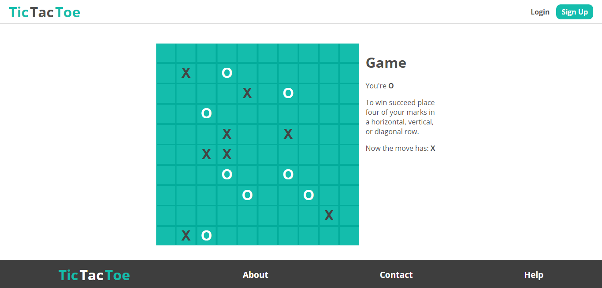

# TicTacToe
A project of the TicTacToe game. Players can play on 10x10 board. The winner is first who succeeds place four of his marks in a horizontal, vertical, or diagonal row. The application uses WebSocket(STOMP) for communication.

## Technologies
Project is created with:
* Java
* Lombok
* Spring
* Hibernate
* Thymeleaf
* PostgreSQL
* JUnit/Mockito
